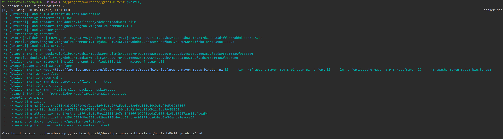

###  pom 的配置
    环境是：graalvm21+springboot3   windows: docker desktop
    spring 的项目只有一个简单的controller 代码其实不太重要(忽略)


```xml
<?xml version="1.0" encoding="UTF-8"?>
<project xmlns="http://maven.apache.org/POM/4.0.0"
         xmlns:xsi="http://www.w3.org/2001/XMLSchema-instance"
         xsi:schemaLocation="http://maven.apache.org/POM/4.0.0 http://maven.apache.org/xsd/maven-4.0.0.xsd">
    <modelVersion>4.0.0</modelVersion>

    <groupId>org.example</groupId>
    <artifactId>graalvm-test</artifactId>
    <version>1.0-SNAPSHOT</version>

    <properties>
        <java.version>21</java.version>
        <spring-boot.version>3.0.6</spring-boot.version>
        <maven.compiler.source>21</maven.compiler.source>
        <maven.compiler.target>21</maven.compiler.target>
        <project.build.sourceEncoding>UTF-8</project.build.sourceEncoding>
        <native-buildtools.version>0.9.28</native-buildtools.version>
    </properties>

    <dependencyManagement>
        <dependencies>
            <dependency>
                <groupId>org.springframework.boot</groupId>
                <artifactId>spring-boot-dependencies</artifactId>
                <version>${spring-boot.version}</version>
                <type>pom</type>
                <scope>import</scope>
            </dependency>
        </dependencies>
    </dependencyManagement>

    <dependencies>
        <dependency>
            <groupId>org.springframework.boot</groupId>
            <artifactId>spring-boot-starter-web</artifactId>
        </dependency>
    </dependencies>

    <build>
        <plugins>
            <plugin>
                <groupId>org.apache.maven.plugins</groupId>
                <artifactId>maven-compiler-plugin</artifactId>
                <version>3.11.0</version>
                <configuration>
                    <source>21</source>
                    <target>21</target>
                </configuration>
            </plugin>
            <plugin>
                <groupId>org.springframework.boot</groupId>
                <artifactId>spring-boot-maven-plugin</artifactId>
                <version>${spring-boot.version}</version>
                <configuration>
                    <excludes>
                        <exclude>
                            <groupId>org.projectlombok</groupId>
                            <artifactId>lombok</artifactId>
                        </exclude>
                    </excludes>
                </configuration>
            </plugin>
        </plugins>
    </build>

    <profiles>
        <profile>
            <id>native</id>
            <build>
                <plugins>
                    <plugin>
                        <groupId>org.springframework.boot</groupId>
                        <artifactId>spring-boot-maven-plugin</artifactId>
                        <version>${spring-boot.version}</version>
                        <executions>
                            <execution>
                                <id>process-aot</id>
                                <goals>
                                    <goal>process-aot</goal>
                                </goals>
                            </execution>
                        </executions>
                    </plugin>
                    <plugin>
                        <groupId>org.graalvm.buildtools</groupId>
                        <artifactId>native-maven-plugin</artifactId>
                        <version>${native-buildtools.version}</version>
                        <configuration>
                            <classesDirectory>${project.build.outputDirectory}</classesDirectory>
                            <metadataRepository>
                                <enabled>true</enabled>
                            </metadataRepository>
                            <requiredVersion>22.3</requiredVersion>
                            <buildArgs>
                                <buildArg>--enable-url-protocols=http,https</buildArg>
                                <buildArg>--no-fallback</buildArg>
                            </buildArgs>
                        </configuration>
                        <executions>
                            <execution>
                                <id>build-native</id>
                                <goals>
                                    <goal>compile-no-fork</goal>
                                </goals>
                                <phase>package</phase>
                            </execution>
                        </executions>
                    </plugin>
                </plugins>
            </build>
        </profile>
    </profiles>

</project>
```


dockerfile

```dockerfile
# 第一阶段：构建阶段
FROM ghcr.io/graalvm/graalvm-community:21 AS builder

# 设置环境变量（使用正确的 JAVA_HOME 路径）
ENV JAVA_HOME=/opt/graalvm-community-java21
ENV PATH=$JAVA_HOME/bin:$PATH

# 安装 Maven 和构建工具（不更新系统，避免依赖冲突）
RUN microdnf install -y wget tar findutils && \
    microdnf clean all

# 安装 Maven
RUN wget https://archive.apache.org/dist/maven/maven-3/3.9.5/binaries/apache-maven-3.9.5-bin.tar.gz && \
    tar -xzf apache-maven-3.9.5-bin.tar.gz -C /opt && \
    ln -s /opt/apache-maven-3.9.5 /opt/maven && \
    rm apache-maven-3.9.5-bin.tar.gz

ENV MAVEN_HOME=/opt/maven
ENV PATH=$MAVEN_HOME/bin:$PATH

# 设置工作目录
WORKDIR /app

# 复制 Maven 配置文件（利用 Docker 缓存层）
COPY pom.xml .

# 下载依赖（利用缓存）
RUN mvn dependency:go-offline -B || true

# 复制源代码
COPY src ./src

# Spring Boot AOT 处理和编译 Native Image
RUN mvn -Pnative clean package -DskipTests

# 第二阶段：运行阶段（使用轻量级镜像）
FROM debian:bookworm-slim

WORKDIR /app

# 从构建阶段复制编译好的原生可执行文件
COPY --from=builder /app/target/graalvm-test app

# 暴露端口
EXPOSE 8080

# 运行原生可执行文件
CMD ["./app"]

```


```shell
docker build -t graalvm-test .
docker run -d -p 8080:8080 --name graalvm-test-app graalvm-test
```





    

    
    